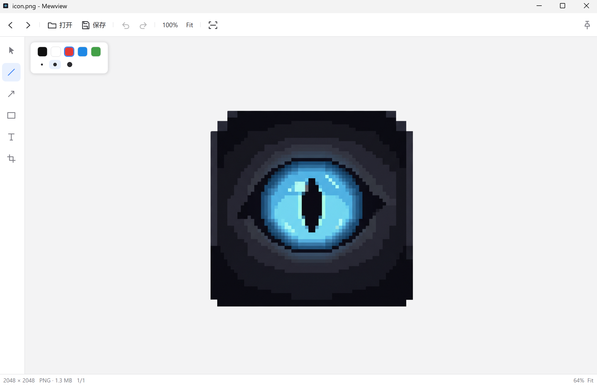

# Mewview

一个轻量的 Windows 图片查看器，内置本地 OCR、标注、裁剪与置顶功能。

A lightweight Windows image viewer with local OCR, annotation, cropping, and always-on-top support.

[Download](#download) · [Microsoft Store](#microsoft-store) · [GitHub Releases](#portable-version)

---

## 功能 Features

- **图片查看** — 支持 JPG / PNG / WEBP / BMP，极简界面，图片占据主要空间
- **本地 OCR** — 中英文 + 韩文，完全本地运行，图片与文字不上传
- **标注** — 画线、箭头、矩形、文字
- **裁剪** — 框选裁剪
- **置顶** — 窗口保持在最上层（Ctrl+Shift+Space）
- **剪贴板** — 复制图片（Ctrl+C）、粘贴打开（Ctrl+V）
- **无广告 · 无账户 · 无遥测 · 免费**

---

## 截图 Screenshots



*Mewview 主界面 — 图片查看、左侧工具栏、顶部标注调色板*

---

## 下载 Download

### Microsoft Store

> 待上架。将在 Microsoft Store 上线后提供链接。

Coming soon.

### 便携版 Portable Version

下载最新 win-x64 便携版 ZIP（自包含，解压即用，无需安装 .NET 运行时）：

[下载最新版 (win-x64 portable)](https://github.com/shierrrrrr/Mewview/releases/latest)

Download the latest win-x64 portable ZIP (self-contained, no .NET runtime required):

[Download latest (win-x64 portable)](https://github.com/shierrrrrr/Mewview/releases/latest)

### 源码 Source Code

本仓库即源码。构建方法见下方「开发 Development」。

---

## 系统要求 System Requirements

- Windows 10 / 11（x64）
- 无需安装 .NET 运行时（便携版为自包含发布）

---

## 安装 Installation

- **Store 版**：通过 Microsoft Store 安装（即将上线）
- **便携版**：解压 ZIP 到任意目录，运行 `Mewview.exe`

---

## OCR

OCR 使用 PP-OCRv5 模型，完全本地运行。首次使用时，程序会询问是否下载模型（约 36 MB，仅一次），下载后缓存到本地（`%LOCALAPPDATA%\Mewview\models`），后续运行不再重复下载。

- 语言：中文 + English、한국어
- 图片与 OCR 内容**不会**上传到任何服务器

---

## 快捷键 Keyboard Shortcuts

| 操作 | 快捷键 |
|---|---|
| 打开图片 | Ctrl + O |
| 从剪贴板打开 | Ctrl + V |
| 复制图片 | Ctrl + C |
| 保存（覆盖）/ 另存为 | Ctrl + S / Ctrl + Shift + S |
| 撤销 / 重做 | Ctrl + Z / Ctrl + Y |
| 上一张 / 下一张 | ← / → |
| 适应窗口 / 实际大小 | Ctrl + 0 / Ctrl + 1 |
| 窗口置顶 | Ctrl + Shift + Space |
| OCR | Ctrl + E |
| 退出当前工具 / 关闭图片 | Esc |

完整列表见 [docs/KEYBOARD_SHORTCUTS.md](docs/KEYBOARD_SHORTCUTS.md)。

---

## 隐私 Privacy

Mewview 是一个纯本地应用：

- 图片与 OCR 内容**不会**上传到任何服务器
- OCR 完全本地运行
- 无遥测、无分析、无账户、无自动更新
- 唯一的网络行为是用户主动触发的 OCR 模型首次下载

详见 [docs/PRIVACY.md](docs/PRIVACY.md)。

---

## 第三方许可 Third-Party Licenses

本项目使用以下开源软件与模型，许可证均宽松、允许再分发：

- SkiaSharp（MIT）
- RapidOcrNet（Apache-2.0）
- Microsoft.ML.OnnxRuntime（MIT）
- Clipper2（BSL-1.0）
- PP-OCRv5 模型（Apache-2.0）

详见 [THIRD-PARTY-NOTICES.md](THIRD-PARTY-NOTICES.md)。

---

## 开发 Development

```bash
# 还原依赖
dotnet restore Mewview.sln

# 构建
dotnet build Mewview.sln -c Release
```

- 技术栈：C# / .NET 10 / WPF
- 架构说明见 [docs/ARCHITECTURE.md](docs/ARCHITECTURE.md)

---

## 已知问题 Known Issues

见 [docs/KNOWN_ISSUES.md](docs/KNOWN_ISSUES.md)。

---

## 更新日志 Changelog

见 [CHANGELOG.md](CHANGELOG.md)。

---

## 许可证 License

[MIT](LICENSE)
